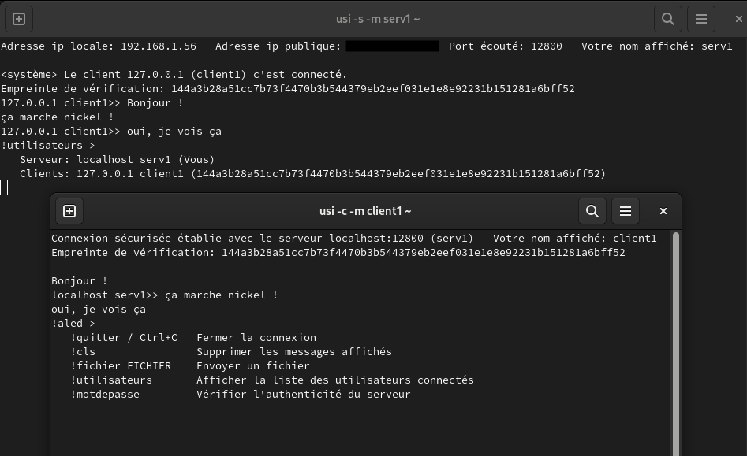

## USI

***Communications simples et chiffrées***

## Sommaire

- [Fonctionnalités et Objectifs](#fonctionnalités-et-objectifs)
- [__Installation__](#installation)
- [__Utilisation__](#utilisation)
- [Détails et Fonctionnement](#détails-et-fonctionnement)
- [USI-lite](#usi-lite)
- [Avertissement et Contribution](#avertissement-et-contribution)

## Fonctionnalités et Objectifs

- __Echange de messages entre deux utilisateurs ou plus.__
- __Envoi de fichiers__ (non chiffrés).
- __Chiffrement de bout en bout__ des messages avec `AES-128-OCB`.
- __Echange de la clé de chiffrement automatique et sécurisé__ avec `RSA-2048`.
- Affichage d'une empreinte de vérification pour vérifier l'identité des utilisateurs.
- __Notifications des messages__ sur Windows et Linux (désactivable).
- Mode développeur pour afficher plus de détails sur le fonctionnement.

L'objectif de USI est de permettre des communications sécurisées dans un environnement minimal.
Comme son nom l'indique (**U**se **S**ignal **I**nstead) il n'a pas vocation à remplacer Signal, il a pour but d'être utilisé dans un environnement réduit aux besoins de sécurité importants.
La confidentialité, l'authenticité et l'intégrité des données échangées est garantie (éxcepté pour les fichiers).
La seule information connue d'un utilisateur est son ip et aucune donnée n'est sauvegardée après la fermeture du programme.

## Installation

Python 3.6+ est requis.

Dans le même répertoire que USI, utiliser la commande suivante pour installer les dépendances python:

    py -m pip install -r requirements.txt

Si vous rencontrez des problèmes lors de l'installation du module pycryptodome, référez-vous à [sa documentation](https://pycryptodome.readthedocs.io/en/latest/src/installation.html#): [ici](https://pycryptodome.readthedocs.io/en/latest/src/installation.html#windows-from-sources-python-3-5-and-newer) pour Windows et [ici](https://pycryptodome.readthedocs.io/en/latest/src/installation.html#compiling-in-linux-ubuntu) pour Linux.

## Utilisation

__Pour lancer USI :__

Dans un terminal :

    python3 ./usi.py

__Pour utiliser USI :__

L'un des utilisateurs devra lancer USI en mode serveur pour attendre les clients.
Pour recevoir des connexions hors du réseau local, penser à ouvrir le port utilisé (12800 par défaut) sur le routeur.

    usi.py -s

Les autres devront alors utiliser le mode client en précisant l'hôte (ip) du serveur.
Pour se connecter sur la même machine (localhost), omettez l'argument -i.

    usi.py -c -i HOTE

Une erreur commune en lançant le serveur:

    Erreur: ce port est déjà utilisé.

Dans ce cas, utiliser un port différent ou actualiser l'environnement bash (ouvrir une nouvelle fenêtre ou `source /etc/profile`).

## Détails et Fonctionnement

*Se référer à la bibliothèque pycryptodome pour les détails cryptographiques.*

Les connexions se font via n'importe quel réseau IPv4 local ou public.
Une fois démarré, le serveur attend et accepte les clients en boucle, sans limite.  
A chaque connexion avec le serveur, le client génère la clé de session de `128 bits`
et la lui envoi automatiquement de manière sécurisée (voir 'Echange de la clé de session' ci-dessous). Ainsi, les communications sont chiffrées de bout en bout
avec `AES-128-OCB` en utilisant une clé de session différente pour chaque client.

Les messages envoyés par le serveur sont chiffrés et envoyés à chaque client.
Les messages envoyés par un client sont reçus par le serveur, puis ce dernier les chiffre et les envois aux autres clients.
Il ce passe exactement la même chose pour les fichiers à l'exception qu'ils ne sont pas chiffrés.

#### Echange de la clé de session:

Le client et le serveur génèrent une paire de clé `RSA-2048` chacun.
Le client génère la clé de session de `128 bits` de manière cryptographiquement aléatoire.
Après avoir reçu la connexion TCP du client, le serveur envoi au client sa clé publique.

Le client chiffre la clé de session avec la clé publique du serveur.
Il signe ensuite la clé de session avec sa clé privée RSA en utilisant `RSASSA-PSS`.
La clé publique du client, la clé de session chiffrée ainsi que la signature de la clé de session sont envoyées au serveur.
Les deux parties génèrent un hash `SHA256` de la clé publique du client avec la clé publique du serveur.
C'est l'empreinte de vérification qui permet d'assurer l'identité des interlocuteurs.
Si cette empreinte diffère entre un client et son serveur, il est possible qu'une identité soit usurpée et que la sécurité soit compromise.

Le serveur déchiffre la clé de session avec sa clé privée.
Il vérifie ensuite la signature à l'aide de la clé de session déchiffrée et de la clé publique du client.
Cette signature est nécessaire pour vérifier l'authenticité de la preuve d'identité (clé publique) du client.
Si la signature est incorrecte, cela veut dire que la clé publique du client n'est pas celle qui a été envoyée
ou que la clé de session ne vient pas du client. L'authenticité du serveur est assurée par le fait que seul sa clé privée
(associée à la clé publique précédemment transmise au client qui l'a vérifiée) peut déchiffrer la clé de session chiffrée par le client.

Le client et le serveur possèdent la clé secrète de session.
Les deux parties sont sûres, si les procédures ont bien été respectées par les êtres humains,
qu'ils communiquent à un tiers authentifié.

__Avantages:__
   - La clé de session est gardée confidentielle. Protection contre une écoute passive.
   - L'identité peut être vérifiée manuellement. L'authenticité de ces identités (clés publiques) est assurée.
   - Nouvelles clés publiques générées à chaque fois. Forward security

__Inconvénients:__
   - L'identité n'est pas vérifiée automatiquement et il faut la vérifier à chaque connexion.
   - Vulnérable aux attaques par rejeu.

## USI-lite

Une version allégée est disponible dans [la branche USI-lite](https://github.com/Robin-mlh/USI/tree/USI-lite).

Le but étant de réduire au maximum son poids, les échanges ne sont ***pas sécurisés*** et des fonctionnalités sont omises.

## Avertissement et Contribution

Je ne suis qu'un amateur qui voulait se faire un projet sympa avec de la cryptographie.
Je ne suis pas certifié et je ne peux rien garantir.
**U**se **S**ignal **I**nstead

***Toute remarque constructive est la bienvenue***, n'hésitez pas à contribuer sur GitHub ou à me contacter par mail (`dev_contactmail@protonmail.com`).
