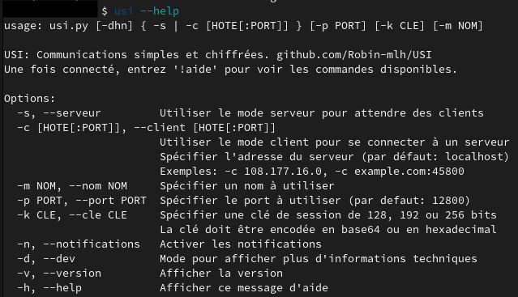

## USI

***Système de communication TCP via socket sécurisé***


## Sommaire

- [Fonctionnalités et Objectifs](#fonctionnalités-et-objectifs)
- [__Installation__](#installation)
- [__Utilisation__](#utilisation)
- [Détails et Fonctionnement](#détails-et-fonctionnement)
- [USI-lite](#usi-lite)
- [Avertissement et Contribution](#avertissement-et-contribution)


## Fonctionnalités et Objectifs

- __Echange de messages entre deux utilisateurs ou plus.__
- __Envoi de fichiers.__
- __Chiffrement de bout en bout__ des messages et fichiers avec `AES-OCB`.
- __Echange de la clé de session automatique et sécurisé__ avec `RSA-2048` et `RSASSA-PSS`.
- Ou chargement d'une clé de chiffrement prédéfinie par l'utilisateur.
- Affichage d'une empreinte de vérification pour vérifier l'identité des utilisateurs.
- Demande d'un mot de passe au serveur pour vérifier son authenticité.
- __Notifications des messages__ sur Windows et Linux (option -n pour activer).
- __Spécification d'un pseudo__ (-m NOM)
- Mode développeur pour afficher plus de détails sur le fonctionnement (option --dev pour activer).

L'objectif de USI est de permettre des communications sécurisées dans un environnement minimal.
Comme son nom l'indique (**U**se **S**ignal **I**nstead) il n'a pas vocation à remplacer une application comme Signal,
il a pour but d'être utilisé dans un environnement réduit aux besoins de sécurité importants.
L'implémentation de l'interface en ligne de commande (CLI) permet une utilisation
sur n'importe quel support tout en assurant un bon confort d'utilisation.
La confidentialité, l'authenticité et l'intégrité des données échangées sont garanties.
Les seules informations connues d'un utilisateur sont: son ip et son pseudo de session s'il l'a spécifié.
Aucune donnée n'est sauvegardée après la fermeture du programme.


## Installation

Python 3.6+ est requis.

Dans le même répertoire que USI, utiliser la commande suivante pour installer les dépendances python:

    py -m pip install -r requirements.txt

Si vous rencontrez des problèmes lors de l'installation du module pycryptodome,
référez-vous à [sa documentation](https://pycryptodome.readthedocs.io/en/latest/src/installation.html#): [ici](https://pycryptodome.readthedocs.io/en/latest/src/installation.html#windows-from-sources-python-3-5-and-newer) pour Windows et [ici](https://pycryptodome.readthedocs.io/en/latest/src/installation.html#compiling-in-linux-ubuntu) pour Linux.


## Utilisation

__Pour lancer USI :__

Dans un terminal :

    python3 usi.py

__Pour utiliser USI :__

L'un des utilisateurs devra lancer USI en mode serveur pour attendre les clients.
Pour recevoir des connexions hors du réseau local, pensez à ouvrir le port utilisé (`port 12800 par défaut`) sur le routeur.

    usi.py -s

Les autres devront alors utiliser le mode client en précisant l'hôte (ip) du serveur.
Pour se connecter sur la même machine (localhost), nul besoin de spécifier d'hôte.

    usi.py -c [HOTE[:PORT]]

Par exemple, la commande suivante utilise le mode client pour se connecter au serveur 172.16.254.1.
Elle active aussi les notifications et spécifie le nom à afficher.

    usi -c 172.16.254.1 -n -m "Georges"




Si le client reste bloqué sur ```Connexion à example.com:12800...   ctrl+c pour annuler```,
cela signifie que l'adresse du serveur est injoignable.
Vérifiez alors que l'adresse hôte et le port utilisé sont accessibles depuis l'extérieur.

Une erreur commune en lançant le serveur:

    Erreur: ce port est déjà utilisé.

Dans ce cas, utiliser un port différent ou actualiser l'environnement bash (ouvrir une nouvelle fenêtre ou entrer `source /etc/profile`).

À noter que les fichiers volumineux (+1 go) peuvent causer des crashs et leur réception peut s'avérer difficile.

## Détails et Fonctionnement

*Se référer à la bibliothèque pycryptodome pour les détails cryptographiques.*

Les connexions se font via n'importe quel réseau IPv4 local ou public.
Une fois démarré, le serveur attend et accepte les clients en boucle, sans limite de nombre.

Si une clé de chiffrement prédéfinie par l'utilisateur est spécifiée avec l'option --cle CLE,
elle est utilisée comme clé de session et les autres utilisateurs doivent charger la même clé.
La clé doit être encodée en base64 ou hexadécimal et peut-être d'une longueur de `128, 192 ou 256 bits`.
Ainsi, les communications sont chiffrées de bout en bout avec `AES-X-OCB` en utilisant la même clé de session pour chaque client.
Dans ce cas, l'empreinte de vérification affichée correspond au hash `SHA256` de la clé de chiffrement.

Sinon, chaque client génère automatiquement une clé de `128 bits` et l'envoie au serveur de manière sécurisée (voir 'Echange de la clé de session' ci-dessous).
Ainsi, les communications sont chiffrées de bout en bout avec `AES-128-OCB` en utilisant une clé de session différente pour chaque client.

Les messages et fichiers envoyés par le serveur sont chiffrés et envoyés à chaque client.
Les messages et fichiers envoyés par un client sont reçus et déchiffrés par le serveur, puis ce dernier les chiffre et les envois aux autres clients.

Le client peut utiliser la commande `!motdepasse` pour vérifier l'authenticité du serveur en lui demandant un mot de passe.
Il définie alors un mot de passe, puis le serveur en saisi un à son tour et envoi au client le hash de celui-ci.
Un client peut alors vérifier que le serveur connait un mot de passe.
Le mot de passe est d'abord hashé avec `SHA256`, encodé en base64 puis hashé avec `bcrypt`.
Un paramètre de cout de 12 et un sel de 16 octets est utilisé.


#### Echange de la clé de session automatique:

*Cette partie n'est pas exécutée lorsque la clé de session est spécifiée par l'utilisateur.*

Le client et le serveur génèrent une paire de clé `RSA-2048` chacun.
Le client génère la clé de session de `128 bits` de manière cryptographiquement aléatoire.
Après avoir reçu la connexion TCP du client, le serveur envoi au client sa clé publique.

Le client chiffre la clé de session avec la clé publique du serveur.
Il signe ensuite la clé de session avec sa clé privée RSA en utilisant `RSASSA-PSS`.
La clé publique du client, la clé de session chiffrée ainsi que la signature de la clé de session sont envoyées au serveur.
Les deux parties génèrent un hash `SHA256` de la clé publique du client avec la clé publique du serveur.
C'est l'empreinte de vérification qui permet d'assurer l'identité des interlocuteurs.
Sans avoir vérifié via un canal sûr que l'empreinte est la même pour un client et son serveur,
l'authenticité de l'identité des deux parties n'est pas garantie.

Le serveur déchiffre la clé de session avec sa clé privée.
Il vérifie ensuite la signature à l'aide de la clé de session déchiffrée et de la clé publique du client.
Cette signature est nécessaire pour vérifier l'authenticité de la preuve d'identité (clé publique) du client.
Si la signature est incorrecte, cela veut dire que la clé publique du client n'est pas celle qui a été envoyée
ou que la clé de session ne vient pas du client. L'authenticité du serveur est assurée par le fait que seul sa clé privée
(associée à la clé publique précédemment transmise au client qui l'a vérifiée) peut déchiffrer la clé de session chiffrée par le client.

Le client et le serveur possèdent la clé secrète de session.
Les deux parties sont sûres, si les procédures ont bien été respectées par les êtres humains,
qu'ils communiquent avec la bonne personne.

__Avantages:__
   - La clé de session est gardée confidentielle. Protection contre une écoute passive.
   - L'identité peut être vérifiée manuellement. L'authenticité de ces identités (clés publiques) est assurée.
   - Nouvelles clés (de chiffrement et clés publiques) générées à chaque fois. Forward security

__Inconvénients:__
   - La véracité de l'identité n'est pas vérifiée automatiquement et il faut la vérifier à chaque connexion.
   - Potentiellement vulnérable aux attaques par rejeu.


## USI-lite

Une version allégée est disponible dans [la branche USI-lite](https://github.com/Robin-mlh/USI/tree/USI-lite).

Le but étant de réduire au maximum son poids, les échanges ne sont ***pas sécurisés*** et des fonctionnalités sont omises.


## Avertissement et Contribution

Je ne suis qu'un amateur qui voulait se faire un projet sympa avec de la cryptographie.
Je ne suis pas certifié et je ne peux rien garantir.
**U**se **S**ignal **I**nstead

***Toute remarque constructive est la bienvenue***, n'hésitez pas à contribuer sur GitHub ou à me contacter par mail (`dev_contactmail@protonmail.com`).